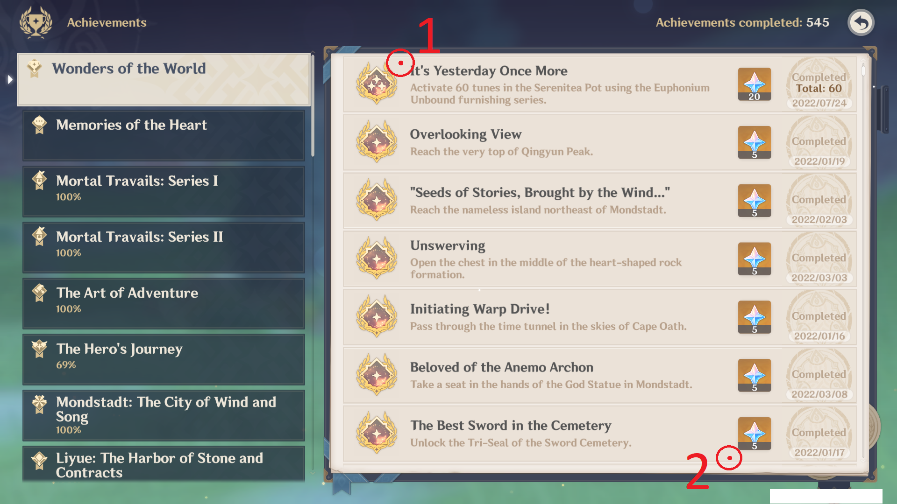

<div align="center">


An automated tool that retrieves a list of all incomplete achievements in [Wonders Of The World](https://genshin-impact.fandom.com/wiki/Wonders_of_the_World) and [Memories Of The Heart](https://genshin-impact.fandom.com/wiki/Memories_of_the_Heart) categories in [Genshin Impact v4.4](https://genshin.hoyoverse.com/).

</div>

## 📝 How To Use

- To retrieve achievements from [Wonders Of The World](https://genshin-impact.fandom.com/wiki/Wonders_of_the_World), copy the contents of [```res/WondersOfTheWorld.txt```](res/WondersOfTheWorld.txt) into [```res/SrcAchievements.txt```](res/SrcAchievements.txt).

- To retrieve achievements from [Memories Of The Heart](https://genshin-impact.fandom.com/wiki/Memories_of_the_Heart), copy the contents of [```res/MemoriesOfTheHeart.txt```](res/MemoriesOfTheHeart.txt) into [```res/SrcAchievements.txt```](res/SrcAchievements.txt).

## 🛠️ How To Build

- Install [Tesseract 5](https://digi.bib.uni-mannheim.de/tesseract/).

- Specify the location where Tesseract is installed by updating line 7 of [```src/Main.py```](src/Main.py).

- Install all required Python packages w/ [```Requirements.txt```](./Requirements.txt).

```
pip install -r Requirements.txt
```

- Run [```src/Main.py```](src/Main.py) w/ Python with **Admin** level.

```
py ./src/Main.py
```

- Click as shown in the picture below.



- The incomplete achievements will be listed in ```output/NotCompleted.txt```.

---

<div align="center">
  Copyright &#169; 2022 PyroWilDx. All Rights Reserved.
</div>
