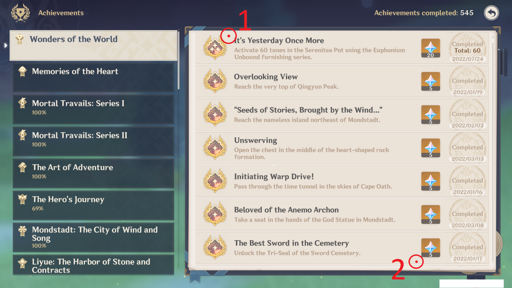

# Genshin Achievement Scrapper (2023)

## Description

Genshin Impact &ndash; Version 4.4.

Use this script to get a list of all the achievements you didn't complete in the category "Wonders of the World" and "Memories of the Heart".

I made this script because we can't see the achievements we did not complete in the game.

## Requirements

1. Python 3.6+ ([PyTesseract](https://pypi.org/project/pytesseract/), [PyAutoGui](https://pypi.org/project/PyAutoGUI/), [PyWin32](https://pypi.org/project/pywin32/), [Multiple ScreenShots](https://pypi.org/project/mss/), [BeautifulSoup](https://pypi.org/project/beautifulsoup4/)).

2. [Tesseract](https://digi.bib.uni-mannheim.de/tesseract/) 5.0.0+.

## Instructions

If you want to get achievements from "Wonders of the World", you'll have to copy the content of [```res/wonders_of_the_world.txt```](res/wonders_of_the_world.txt) into [```res/src_achievements.txt```](res/src_achievements.txt). You can do the same for "Memories of the Heart" with [```res/memories_of_the_heart.txt```](res/memories_of_the_heart.txt).

1. First, you'll need to specify where you installed Tesseract by modifying the 6th line in [```src/main.py```](src/main.py).

Note &ndash; If you chose the installation by default for Tesseract, you can just input your Windows username when the script starts.

2. Run [```src/main.py```](src/main.py) **as an administrator** with Python.

3. The script will ask you to click as shown in the picture below.



4. When the program ends, the achievements that you didn't complete will be in ```output/not_completed.txt```.
